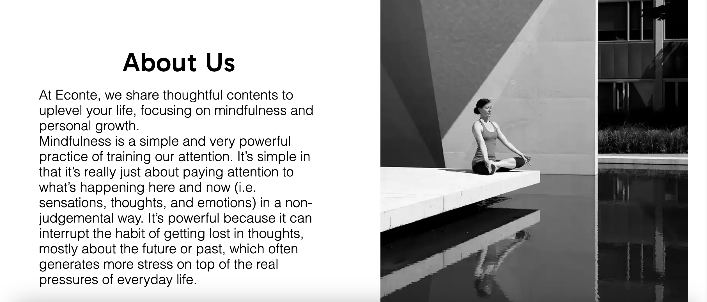
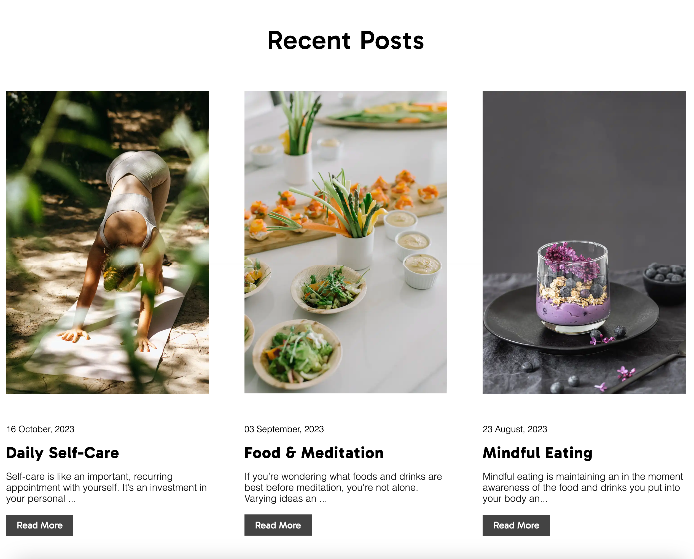
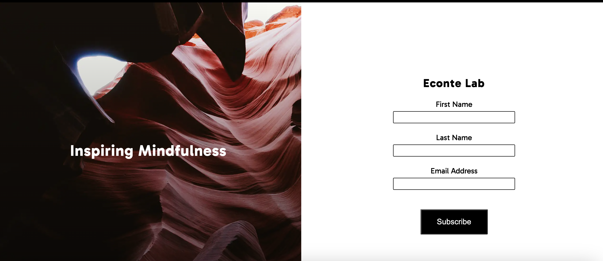

# Econte Lab

Econte Lab is a blog site that hopes to create a platform where like-minded individuals can keep motivated to live mindfully by sharing tips and straties on how to become a mindful pereson.

It is available to the whole world aiming to enrich other people’s lives by providing content that can help hone a positive outlook toward life.

## Features 

### Existing Features

- __Navigation Bar__

  - Featured at the top of the page, the navigation shows the blog name in the left corner: Econte.
  - Featured on all three pages on the right, the full responsive navigation bar includes links to the Home, Blog and Subscibe page and is identical in each page to allow for easy navigation.
  - This section will allow the user to easily navigate from page to page across all devices without having to revert back to the previous page via the ‘back’ button.
  - THe navigation clearly tells the user the name website and makes the different sections of information easy to read.

 

- __The landing page image__

  - The landing includes a photograph with text overlay to allow the user to see exactly which location this site would be applicable to. 
  - This section introduces the users of Econte with an eye catching zoom effect animation to grab their attention

 

- __Video Section__

  - The video section will visually inspire and encourage the user to consider yoga as their form of practice for mindful living.

- __About Section__

  - About section will allow the users to understand what is mindfulness and see the benefits of joining the community of mindfulness. 
  - Users will see the value of signing up for the Econte blog subbcription.

- __The Footer__ 

  - The footer section includes links to the relevant social media sites (Facebook, Youtube, Instagram) for Econte. The links will open to a new tab to allow easy navigation for the user. 
  - The footer is valuable to the user as it encourages them to keep connected via social media.

- __Blog Page__

  - The blog page will provide the users with thoughtful contents to uplevel their life, focusing on mindfulness and personal growth.
  - This section is valuable to the user as the contents will be able to provide valuble insight and tips on living mindfully.

- __Subscribe Page__

  - This page will allow the user to subscibe for a dose of inspiration for mindful living. The user will be asked to submit their first name, last name and email address. 

### Features Left to Implement

- In the future, I would like to implement a feature where users can view and signup for mindfulness classes (provided by thirt party) arounds the world.
- Mindfulness classes such as meditation, soundbath and yoga etc. are the some of examples.

