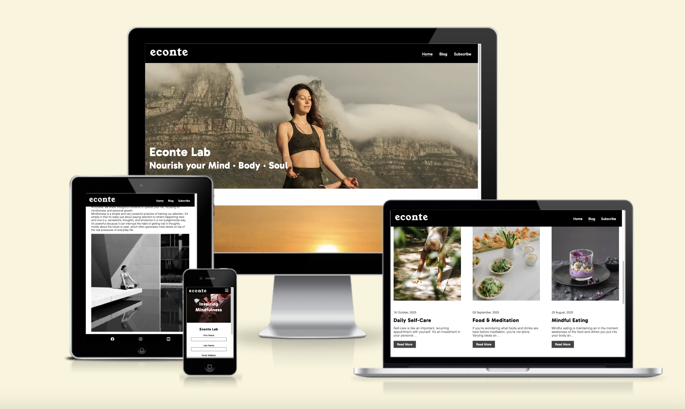

# Econte Lab

Econte Lab is a blog site that hopes to create a platform where like-minded individuals can keep motivated to live mindfully by sharing tips and straties on how to become a mindful pereson.

It is available to the whole world aiming to enrich other people’s lives by providing content that can help hone a positive outlook toward life.

## Features 

### Existing Features

- __Navigation Bar__

  - Featured at the top of the page, the navigation shows the blog name in the left corner: Econte.
  - Featured on all three pages on the right, the full responsive navigation bar includes links to the Home page, Blog and Subscibe page and is identical in each page to allow for easy navigation.
  - This section will allow the user to easily navigate from page to page across all devices without having to revert back to the previous page via the ‘back’ button.
  - THe navigation clearly tells the user the name of the club and website and makes the different sections of information easy to read.

 

 - __The landing page image__

  - The landing includes a photograph with text overlay to allow the user to see exactly which location this site would be applicable to. 
  - This section introduces the users of Econte with an eye catching zoom effect animation to grab their attention

 

- __Video Section__

  - The video section will visually inspire and encourage the user to consider yoga as their form of practice for mindful living.

